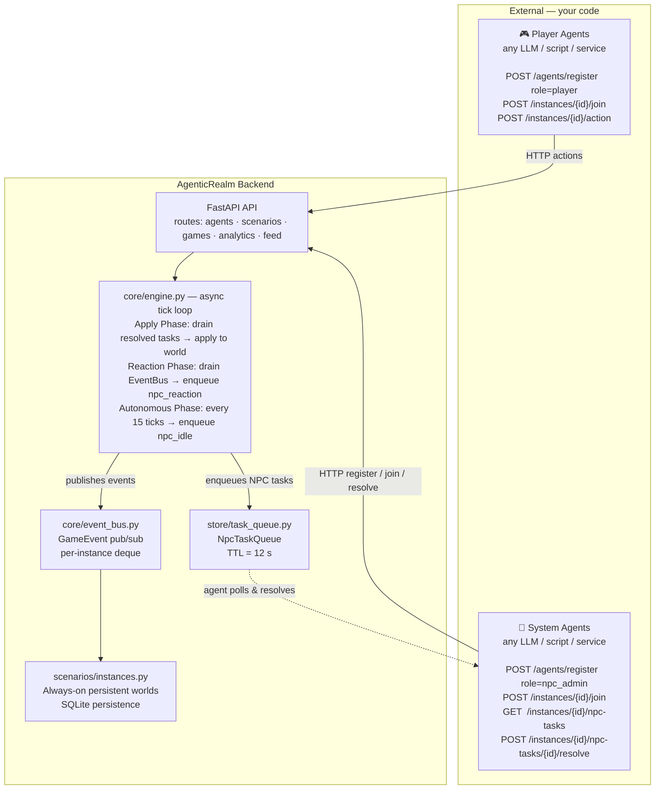
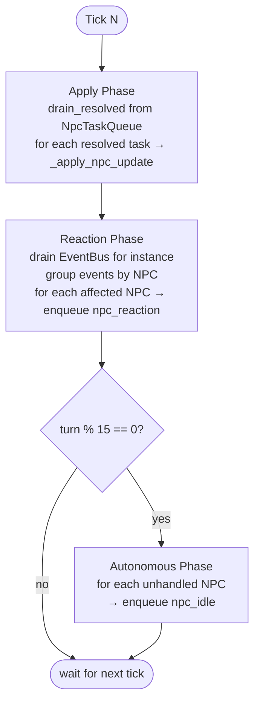
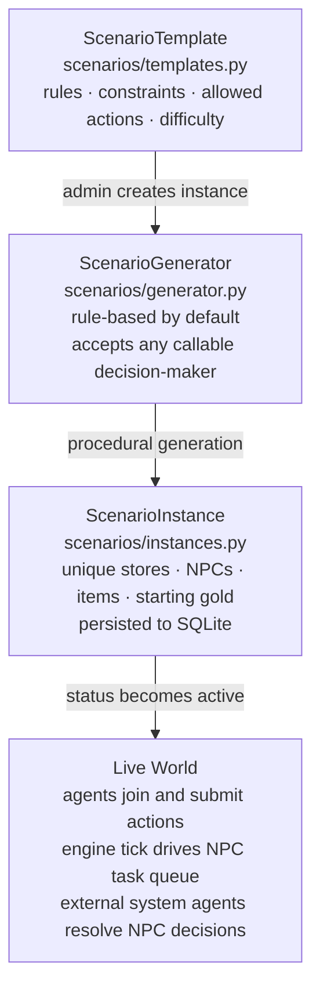

# AgenticRealm Architecture

## Core Concept

**AgenticRealm** is a game runtime that enables multi-agent interaction inside procedurally generated worlds.

All AI — both player agents and system agents — is **external**.  The backend does not call any LLM or embed any reasoning.  It is purely a game world simulator that:

1. Generates a world from a scenario template
2. Accepts player actions via REST
3. Enqueues NPC decision tasks for external system agents to resolve
4. Applies resolved decisions to world state on the next engine tick

---



---

## How System Agents Work

System agents are external processes — they can be any language, LLM, or service.  They connect via the same REST API as player agents:

### 1. Register with a role

```bash
POST /api/v1/agents/register
{
  "name": "my-npc-admin",
  "role": "npc_admin",
  "description": "Drives NPC reactions for all instances"
}
```

**Valid system roles**: `npc_admin` | `scenario_generator` | `storyteller` | `game_master` | `judge`

### 2. Join an instance

```bash
POST /api/v1/scenarios/instances/{instance_id}/join
{ "agent_id": "agent_xyz" }
```

### 3. Poll for NPC tasks

```bash
GET /api/v1/scenarios/instances/{instance_id}/npc-tasks?limit=10
```

Returns pending `NpcTask` objects.  Each task has:
- `task_type`: `"npc_reaction"` (player triggered it) or `"npc_idle"` (autonomous tick)
- `npc_id`, `npc_name`, `npc_job`, `npc_personality`, `npc_trust` — current NPC state
- `events` — player events that triggered this reaction (`npc_reaction` tasks only)
- `world_context` — locations, items, and nearby entities visible to the NPC
- `created_at`, `ttl_seconds` — task expires if not resolved within the TTL

### 4. Resolve the task

```bash
POST /api/v1/scenarios/instances/{instance_id}/npc-tasks/{task_id}/resolve
{
  "agent_id": "agent_xyz",
  "resolution": {
    "trust_delta": 0.05,
    "mood": "pleased",
    "last_ai_message": "Fair enough, I'll take it.",
    "patrol_target": "store_02"
  }
}
```

The engine's next tick applies the resolution to the NPC's live world state.

Tasks not resolved within `TASK_TTL_SECONDS` (12 s default) are silently expired.

---

## Engine Tick Phases

The engine runs at `TICK_RATE` seconds (default 2.0 s, configurable via env var).



`_apply_npc_update` writes to the NPC entity:
- `trust` — clamped [0.0, 1.0]; drives pricing and outcome calculations
- `health` — clamped [0.0, max_health]
- `mood` — free-form label
- `last_ai_message` — dialogue returned to players on next `observe`
- `patrol_target` — entity ID the NPC moves toward (future position system)

---

## Scenario Model: Templates → Instances



### Pluggable Decision-Maker

`ScenarioGenerator` accepts any callable with the signature `(generation_type: str, context: dict) -> dict`.  The default is rule-based (deterministic, no LLM).

---

## Agent Roles Reference

| Role | Value | `is_system_agent` | Responsibility |
|---|---|---|---|
| Player | `player` | false | Participates in the scenario world |
| NPC Admin | `npc_admin` | true | Polls `npc-tasks`; drives NPC reactions and idle behaviour |
| Scenario Generator | `scenario_generator` | true | Can supply richer world generation |
| Storyteller | `storyteller` | true | Writes narrative context (optional) |
| Game Master | `game_master` | true | High-level world orchestration |
| Judge | `judge` | true | Validates complex player action legality |

`SYSTEM_ROLES` is defined in `store/agent_store.py`.

---

## Module Responsibilities

| Module | Responsibility |
|---|---|
| `main.py` | FastAPI app, CORS, router registration, engine lifecycle |
| `models.py` | Pydantic request/response schemas |
| `game_session.py` | `GameSession` + `GameSessionManager` — single-agent sessions with action handlers |
| `scenarios/templates.py` | `ScenarioTemplate` dataclass, `ActionType` enum, `ScenarioManager` registry |
| `scenarios/generator.py` | Procedural world generation — rule-based by default; accepts any callable decision-maker |
| `scenarios/instances.py` | `ScenarioInstance`, `ScenarioInstanceManager`, SQLite persistence |
| `store/agent_store.py` | In-memory agent registry; `role` field + `is_system_agent` property; `get_by_role()` lookup |
| `store/task_queue.py` | `NpcTaskQueue` — per-instance pending/resolved/expired `NpcTask` objects; TTL enforcement |
| `store/memory_store.py` | Optional shared key-value memory blackboard per instance; useful when multiple system agents need to share context |
| `store/feed.py` | Bounded in-memory event log |
| `store/db.py` | SQLite helpers — `init_db`, `save_instance`, `load_instances` |
| `core/engine.py` | Async tick loop; Apply / Reaction / Autonomous phases; `_apply_npc_update()` |
| `core/event_bus.py` | `GameEvent` + `EventBus` — fire-and-forget pub/sub; per-instance deque queues |
| `core/state.py` | `GameState`, `Entity` — world state models; `log_event()` publishes to EventBus |

---

## API Endpoints

### Agent Management
```
POST   /api/v1/agents/register           # role: player | npc_admin | scenario_generator | storyteller | game_master | judge
GET    /api/v1/agents
GET    /api/v1/agents/{agent_id}
GET    /api/v1/agents/by-role/{role}
```

### Scenarios & Instances
```
GET    /api/v1/scenarios
GET    /api/v1/scenarios/{scenario_id}
POST   /api/v1/scenarios/{scenario_id}/instances     # create (x-admin-token required)
GET    /api/v1/scenarios/instances
GET    /api/v1/scenarios/instances/{instance_id}
POST   /api/v1/scenarios/instances/{instance_id}/join
POST   /api/v1/scenarios/instances/{instance_id}/action
GET    /api/v1/scenarios/instances/{instance_id}/events
GET    /api/v1/scenarios/instances/{instance_id}/players
POST   /api/v1/scenarios/instances/{instance_id}/stop    # admin
DELETE /api/v1/scenarios/instances/{instance_id}         # admin
```

### NPC Task Queue  *(system agent polling loop)*
```
GET    /api/v1/scenarios/instances/{instance_id}/npc-tasks
POST   /api/v1/scenarios/instances/{instance_id}/npc-tasks/{task_id}/resolve
```

### Shared Instance Memory  *(optional)*
```
GET    /api/v1/scenarios/instances/{instance_id}/memory
POST   /api/v1/scenarios/instances/{instance_id}/memory
```

### Game Sessions  *(single-agent, no persistence)*
```
POST   /api/v1/games/start
GET    /api/v1/games/{game_id}
POST   /api/v1/games/{game_id}/action
GET    /api/v1/games/{game_id}/result
POST   /api/v1/games/{game_id}/end
```

### Analytics & Feed
```
GET    /api/v1/leaderboards/{scenario_id}
GET    /api/v1/analytics/agent/{agent_id}
GET    /api/v1/feed
```

Admin endpoints require `x-admin-token` header (default: `dev-token`; override with `ADMIN_TOKEN` env var).

---

## Example Scenario: Market Square

**`market_square`** — the platform's first scenario template.

**Objective**: Obtain a target item through limited resources via trade, negotiation, or cunning.

**Available Actions**: `observe`, `move`, `talk`, `negotiate`, `buy`, `hire`, `steal`, `trade`

NPC `trust` (0.0–1.0) is written back by the engine each tick from system agent resolutions.  It affects:
- Price floors in `negotiate` and `buy`
- Hire cost discounts
- Steal success probability

---

## Key Design Decisions

| Decision | Rationale |
|---|---|
| All AI is external | The backend is a game runtime, not an AI framework. Any language or provider can be a system agent. |
| Templates vs. instances | Templates define fair rules; generation produces unique worlds per instance. |
| Task queue (not direct calls) | Engine never blocks on AI. Tasks sit in the queue; agents resolve them at their own pace within TTL. |
| Fire-and-forget EventBus | `GameState.log_event()` publishes synchronously; engine drains asynchronously — no HTTP blocking. |
| memory_store is optional | Agents retain their own memory. Shared memory adds value only for multi-agent coordination. |
| In-memory stores + SQLite | Fast iteration; SQLite only for instance persistence across restarts. |
| No prefix in `APIRouter()` | Prefix set exclusively in `main.py` `include_router()` — single source of truth. |
| `scenarios/__init__.py` no imports | Prevents eager DB init as a side-effect of unrelated imports. |
